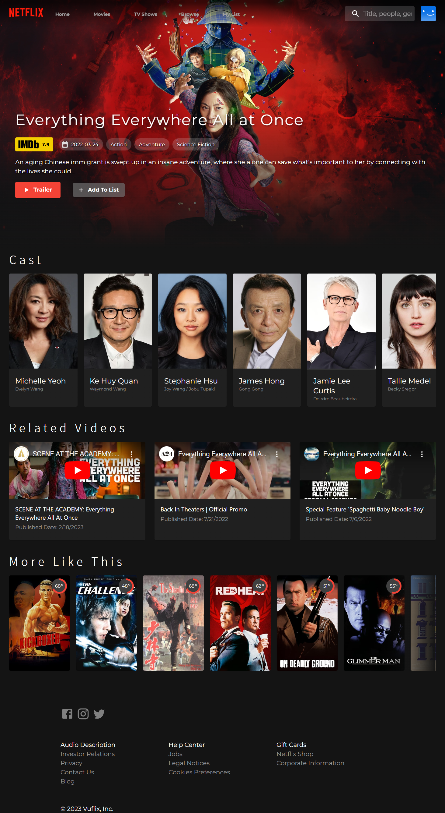
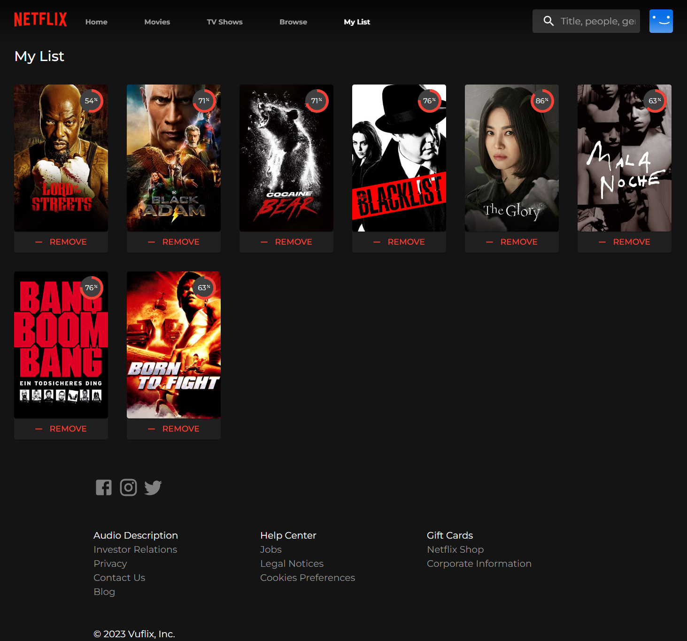
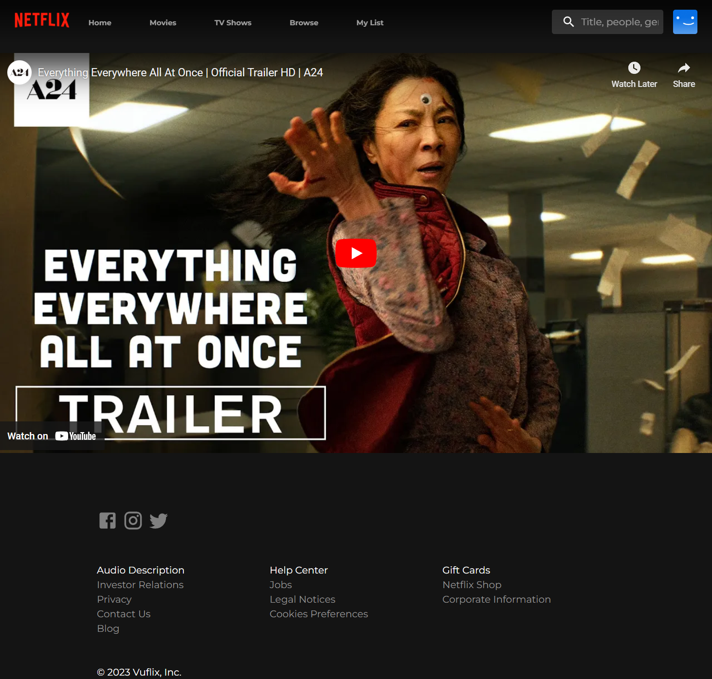
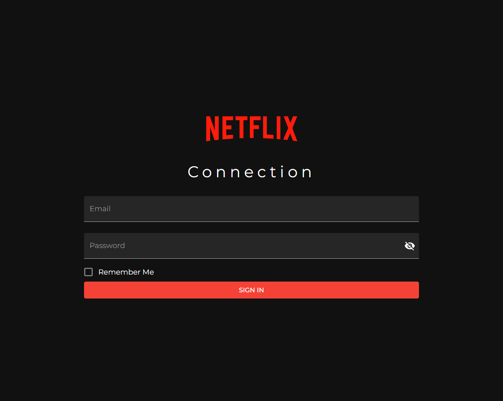

# VuFlix - Netflix Clone

This is a frontend project based on Netflix UI: built with ReactJS.

## Built with

<b>FrontEnd:</b> React.JS, Material UI, CSS.
<b>Dependencies:</b>React-router, Yup, Formik, Axios.

</ul>

Demo: https://bahnmifps-netflix.netlify.app/
Source Code: https://github.com/BahnMiFPS/netflix-clone

## UI

### Home


### Movie Detail Page



### Favourite List



### Player



### Sign in



<h2>Installation </h2>

Use the package manager [npm](https://www.npmjs.com/) to install VuFlix - Netflix Clone.
Setup the project and install the packages by running:

```bash
npm i
```

Run project with command

```bash
npm run dev
```
